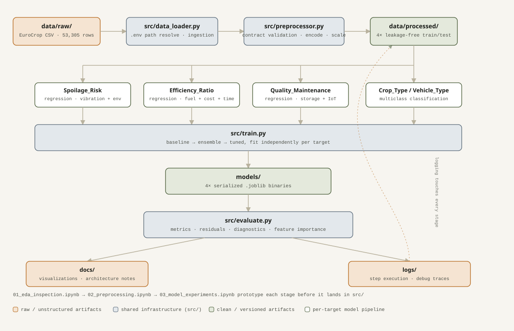
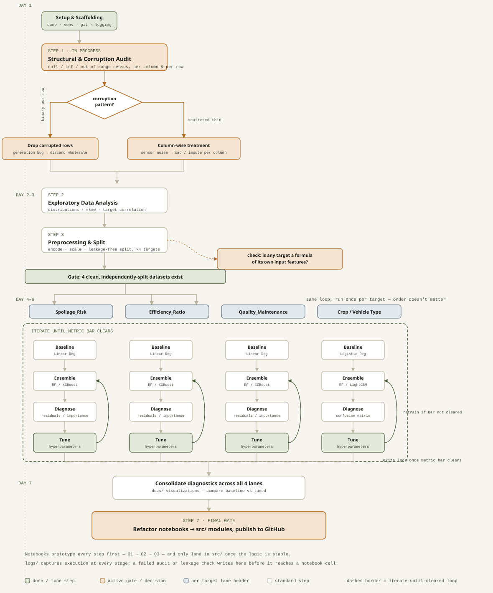

# 🌾 Euro Crop Agricultural Logistics — End-to-End ML Pipeline

An end-to-end Machine Learning pipeline that predicts supply chain efficiency, crop spoilage risk, quality maintenance, and transit classifications across European agricultural supply networks.

---

## 📌 Project Architecture & Workflow

**[▶ Open the interactive version](docs/architecture_diagram/architecture_live.html)** — clone the repo and open `docs/architecture_diagram/architecture_live.html` in a browser for a live, click-to-explore diagram: node colors reflect real build progress (done / in progress / pending, read from `pipeline_state.js`), and hovering or clicking a node shows its role and current status. GitHub's README renderer strips scripts, so this interactive view only runs when opened locally, not embedded on this page.

### Planned Work Flow

